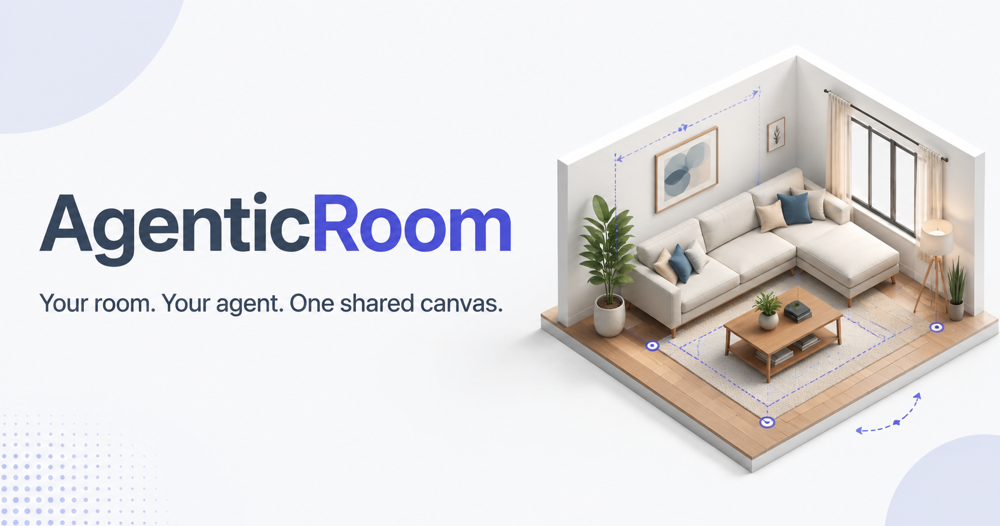

# AgenticRoom

Design your room. Shop the furniture. Stay on budget.



[Try the live planner](https://agenticroom.setyongr.chatgpt.site) ·
[Watch the two-minute demo](https://www.youtube.com/watch?v=8pLkVAU-G80)

AgenticRoom is a 3D furniture shopping and room-planning workspace for people
and browser agents. Browse pieces that fit your budget, place them in the room,
compare cheaper alternatives, and carry your picks into an integrated cart.
WebMCP tools let a compatible agent edit the same room and budget you see on
screen.

Built with Next.js, React, TypeScript, React Three Fiber, and Zustand.

## Getting started

Requires [Bun](https://bun.sh) 1.3.14 and Node.js 20.9 or later.
No API keys, database, or environment variables are required.

```bash
bun install --frozen-lockfile
bun run dev
```

Open [localhost:3000](http://localhost:3000). The initial room includes existing
furniture and a $700 budget for new pieces.

## Features

- Furnish and resize a 3D room, with checks for overlap and opening clearance.
- Browse furniture by price, style, size, availability, and room fit.
- See a live budget breakdown as pieces are placed, with existing furniture
  separated from new marketplace spend.
- Find cheaper alternatives when a design goes over budget, then replace pieces
  without losing their position in the room.
- Add placed marketplace pieces to the integrated cart, prune it down to what
  you actually want, and run a mock checkout (no real payment).
- Let a browser agent inspect and edit the room through 31 WebMCP tools.

The planner works without an agent. WebMCP requires a supporting browser;
see the [integration guide](docs/WEBMCP.md) for setup and tool details.

## Development

```bash
bun run check       # TypeScript
bun run test        # Domain tests
bun run build       # Production static build (Sites)
bun run build:next  # Standard Next.js build for `bun run start`
bun run start       # Serve the production build
```

See [deployment](docs/DEPLOYMENT.md) for hosting settings and access
requirements.

## Limitations

Designs and uploads are session-only; reloading resets the room. Catalog prices
and the cart are demonstrations, and checkout is a mock — no payment is ever
processed. The 3D scene is approximate, not a guarantee of physical fit.

Imported GLBs are visual references, excluded from pricing, layout validation,
and saved designs. They are visible in scene snapshots shared with a connected
agent. No AI service is built into the app.

## Documentation

- [WebMCP](docs/WEBMCP.md): browser setup, tools, and response formats
- [Demo workflows](docs/DEMOS.md): room furnishing and budget reduction
- [Architecture](docs/ARCHITECTURE.md): state, domain rules, and rendering
- [Testing](docs/TESTING.md): automated coverage and manual checks
- [Deployment](docs/DEPLOYMENT.md): hosting and public-release checks
- [Contributing](AGENTS.md): repository conventions

## License

[MIT](LICENSE). The bundled sofa model and its preview have separate
[CC BY 4.0 attribution](THIRD_PARTY_NOTICES.md).
